#Follow along!

You can find these slides on my website: [emmaL73.github.io/github_slides.html](emmaL73.github.io/github_slides.html)

--
###  Happy Git and GitHub for the useR

Most of the info covered here is from [Happy Git and GitHub for the useR](https://happygitwithr.com/) written primarily by Jenny Bryan 


- [Twitter](https://twitter.com/JennyBryan)


- [Website](jennyrbryan.org)

---
# Prereqs


We are starting with the assumption that you are using [RStudio Desktop](https://rstudio.com/products/rstudio/) and are familiar with R and RStudio.

* If you need to download R, do that [here](https://cloud.r-project.org/)

* If you haven't downloaded RStudio, do that [here](https://rstudio.com/products/rstudio/download/)

 + Look for the *free* version of RStudio *Desktop* 
 
 
---
# Outline

1. Sign-up for a GitHub account

1. Install Git

1. Create a repository & add collaborators

1. Clone/download to a .Rproj

1. Commit -> Pull -> Push

1. GitHub best practices

--

Breakout sessions:

Please don't work ahead! If you finish before we move on, help someone near you.


---
# Why Git & GitHub?

[Version control](https://git-scm.com/book/en/v2/Getting-Started-About-Version-Control): keep track of changes to files

--

- Very important for **collaboration**.

- Also helps build a public portfolio!

- Can interface easily with RStudio.

--

**GitHub : RStudio :: Google Drive : Word**

* In RStudio I can make changes to a `.Rmd`, but no one else can see those changes.

* When I incorporate GitHub, other people can collaborate on my R code!

The difference: if I add a few words to a Google doc it doesn't break anything, but in an `.Rmd` it might! This means GitHub has a system of checks so that we don't break each other's code.

---
# Git vs. GitHub


* **Git** is the software that does the version control locally. Git lives on your computer.

* **GitHub** allows for code sharing and collaboration. GitHub is based online. 

[More info here](https://www.theserverside.com/video/Git-vs-GitHub-What-is-the-difference-between-them)

---
# Create a GitHub Account

### Tips

* **Put some thought into your username!** This will be part of your personal brand - it should be short and easy to remember, and something you are comfortable sharing with bosses and the public. 

 + Consider including your name so people will associate it with you.

 + Keep letters lowercase (GitHub is not case sensitive, this is to help out other users)
 
 + Stay away from words associated with programming.
 
--

* Use a **personal** email address, not one you won't have access to in a few years like a student email address.

* Remember your password for later!

---
# Work time: GitHub Account

By the end of this break-out session you need to have a [GitHub account](https://github.com/) ready to go.

Make sure to record/remember your username and password, you will need them later.

---
# Terminal

Within RStudio: in the lower left pane.

[How to find the terminal on your computer](https://happygitwithr.com/shell.html#shell)

---
# Install Git

*[Chapter 6: Install Git](https://happygitwithr.com/install-git.html)*

You may already have Git installed. In the Terminal (a tab option next to the console), type

`which git`

and 

` git --version`

If a version comes up for you, you already have Git installed!

--

If you get something like `git: command not found` continue with the following steps.

---
# Windows Installation

Install [Git for Windows](https://gitforwindows.org/)

* When asked about "Adjusting your PATH environment", select "Git from the command line and also from 3rd-party software"

---
# macOS Installation

Install the Xcode command line tools (not all of Xcode)

Go to the terminal and enter:

`git --version`

or

`git config`

Accept the offer and click "Install"

You can also request the installation more directly:

`xcode-select --install`


---
# "Sign in" to Git

In the Terminal, type the following lines one at a time, substituting in your own username and email address

`git config --global user.name "USERNAME"`

`git config --global user.email "EMAIL"`

`git config -- global --list`

If you would rather do this using a package and function, try

```{r, eval = FALSE}
#install.packages("usethis")
library(usethis)
use_git_config(user.name = "USERNAME", user.email = "EMAIL")
```


---
# Work time: Git installation

By the end of this break-out session you should have Git installed on your computer and have introduced yourself to Git.

If you are having difficulties, consult the [Install Git](https://happygitwithr.com/install-git.html#install-git) chapter of Happy Git and GitHub for the useR. 

---
# Repository

* A **repository** can be imagined as a project folder that lives in GitHub.

 + Contains all of the project files
 
 + Stores revision history
 
 + Can be public or private

---
# Getting started with GitHub

* Have **one person** on your team make a repository on GitHub
 
* Click either "New repository" or from the "Repositories" page, click "New"

 + Name your repository something memorable and related to your project
 
 + My test repo is "sds291-team73"
 
 + Select "Public"
 
 + **Make sure to initialize the repository with a README**
 

---
# Create a Repo

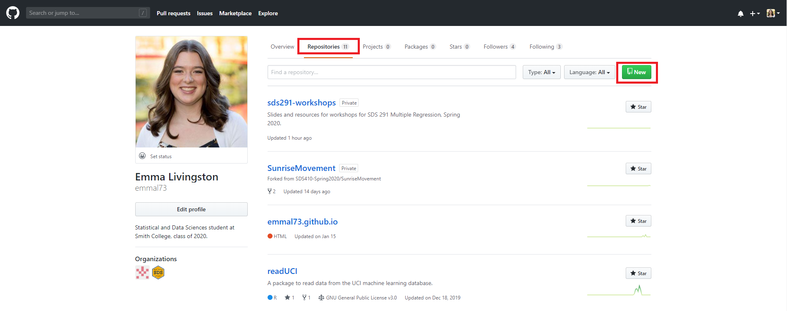

---
# Create a Repo

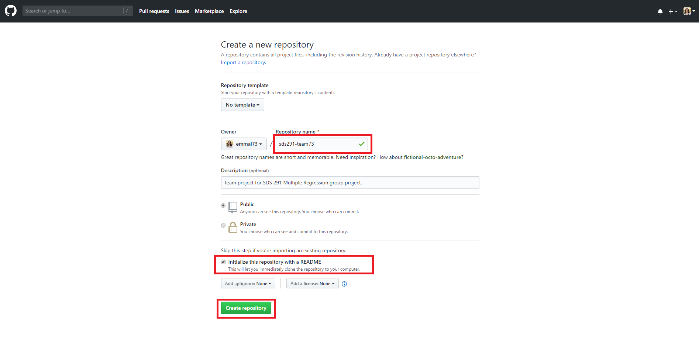


---
# Add Collaborators

The person who created the repository should add your teammates as collaborators. You can search by username, full name, or email.

Collaborators, you will get an email with a link to accept the invitation.

---
# Add Collaborators

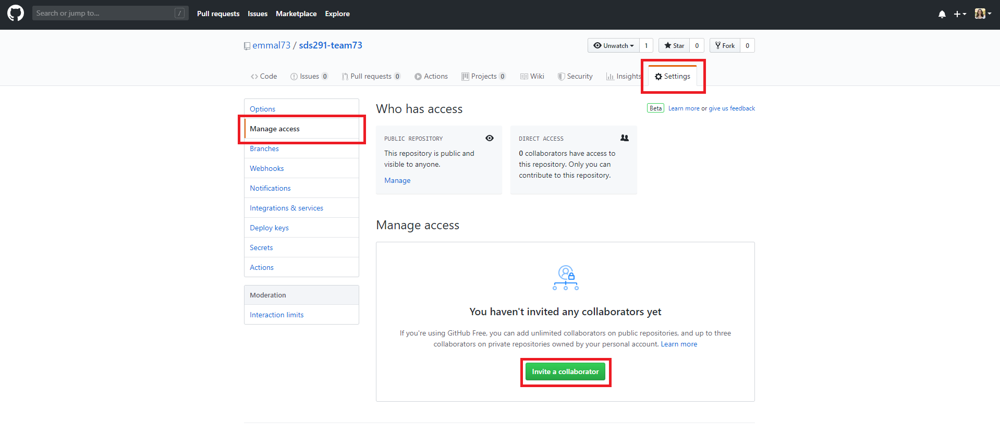

---
# View Invitation

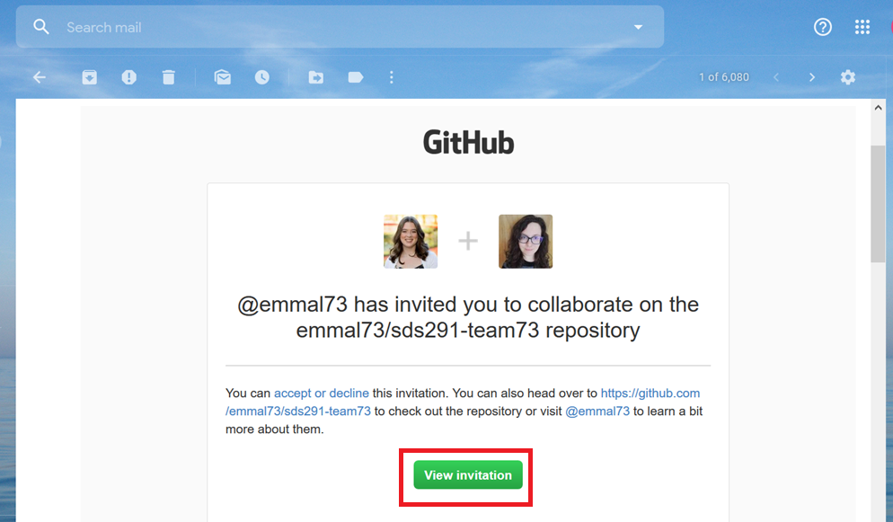

---
# Accept Invitation


---
# Work time: Create a repository

By the end of this break-out session everyone should have push access to the repository.


---
# .Rproj

A "project" can be thought of like a "project folder" or a workspace. 

* They make for easier organization

* Facilitate collaboration through GitHub

An R project will show up as a `.Rproj` file.

The `.Rproj` gets created on your computer, and talks to the repository on GitHub.

---
# Clone or Download

Cloning or downloading a repository is how we connect the GitHub repository to Rstudio through an `.Rproj`.

We start this process from within GitHub, and then move to RStudio.

* You can do it the other way around, but it makes managing files more complicated! I *highly* recommend that when you are starting a new project, start by making a repository on GitHub and then creating the R project.

---
# Clone or Download

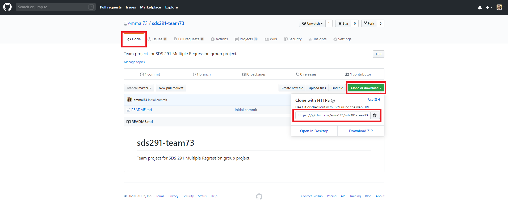

---
# New Project

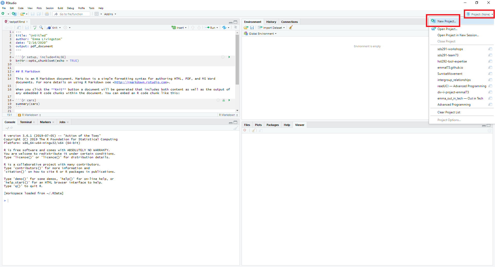

---
# Version Control 

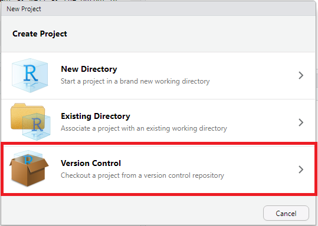

---
# Git New Project

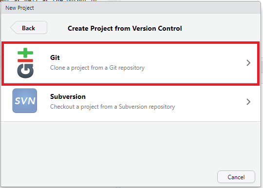

---
# New Project

Repository URL: [PASTE THE CLONE/DOWNLOAD LINK HERE]

Project Directory Name: [THIS SHOULD FILL IN AUTOMATICALLY]

Create Project as a Subdirectory of: [PICK THE FILE FOLDER YOU WANT THIS REPO TO LIVE IN]

---
# New Project

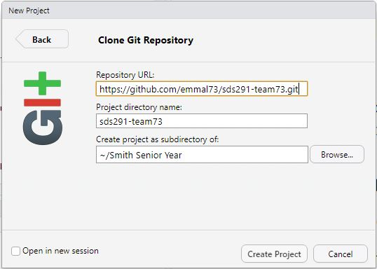

---
# Work time: .Rproj

By the end of this break-out session everyone in your group should be in an R project associated with the repository.


---
# GitHub Actions: Commit

**COMMIT**: saving changes you have made.

* A commit is associated with a specific tag (such as "c2ec6cf") and a **commit message** (such as "Added header and name to readme")

* When to commit?

  + Early and often
  
  + When you find yourself transitioning to a new task (i.e. starting a new visualization, reading in a new file, starting a new model)
  
Collaborators can't see your changes yet.

* Bonus of committing frequently -- they get counted as [contributions](https://github.blog/2013-01-07-introducing-contributions/)

---
# Commit Process

1. Save your work!

2. Stage (check the boxes next to the file names in the "Git" tab in the upper right-hand corner in RStudio)

 + Only stage the files that need to get sent to other people. 
 + **DO NOT stage the .Rproj or the .gitignore!** This will cause problems down the line.
 + rule of thumb for now: if you didn't just change it, don't stage it.

3. Commit

 + Write a commit message! A commit message should be **concise** and **informational**. They should quickly tell the viewer what was accomplished in this commit.
 
For example:
 + Good commit message: "webscrape UCI_datasets"
 + Bad commit message: "maybe this won't break it"
 
(yes both of these are commit messages I [wrote](https://github.com/emmal73/readUCI/commits/master), do as I say not as I do)
 
 
---
# GitHub Actions: Pull

**PULL**: merging changes from collaborators into your own copy. 

* When to pull?

 + When you first sit down to start coding
 
 + Before you push
 
---
# GitHub Actions: Push

**PUSH**: sending your commits to GitHub.

* When to push?

 + After you commit
 
 + Before you stop coding
 
---
# GitHub Workflow

To minimize merge conflicts:

1. commit

2. pull

3. push

---
# Make Changes

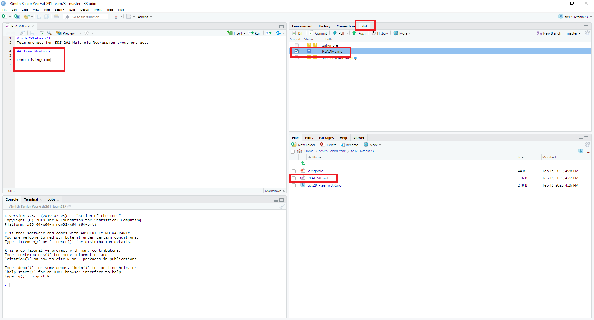

---
# Commit

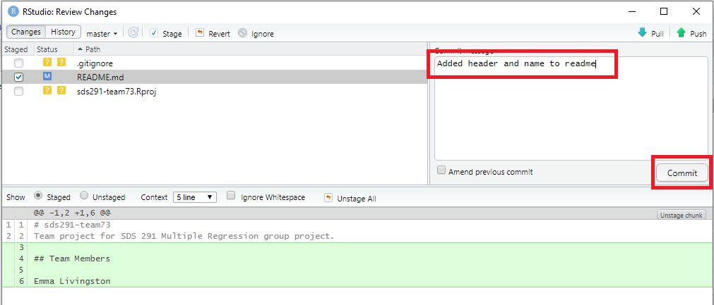

---
# Pull & Push

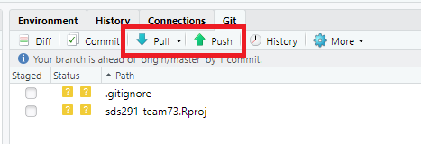

---
# See the Results!

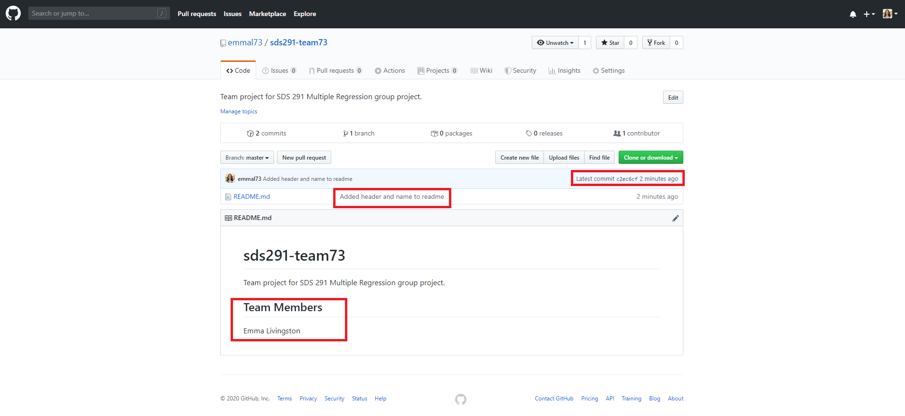

---
# Work time: Commit, pull, push

By the end of this break-out session you should have added your name to the README.md, committed, pulled, and pushed (in that order!).


Make sure you can see everyone's names the README on GitHub!

 

---
# Merge Conflicts

If something goes wrong in the workflow and collaborators are writing over each other's work, you may end up with a **merge conflict**.

These can look scary, but they are totally fixable. 

**It usually happens if you push before you pull, so remember to pull before you push first!**

---
# Merge Conflicts

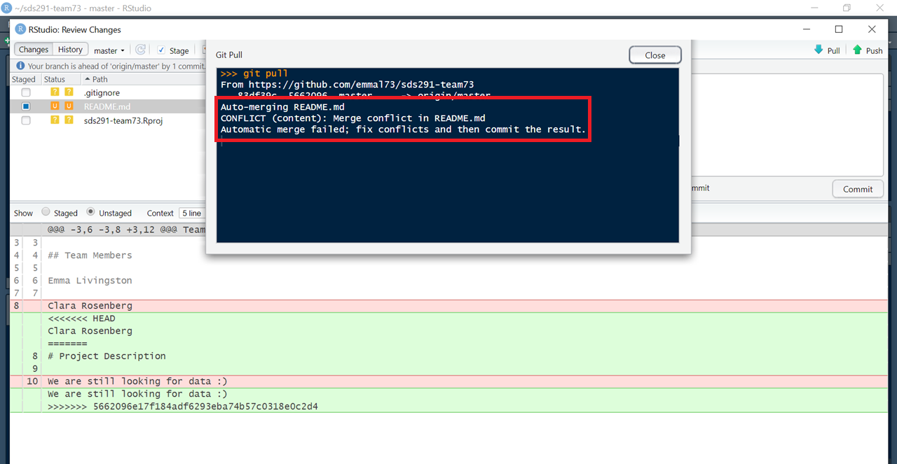

---
# Fix Merge Conflicts

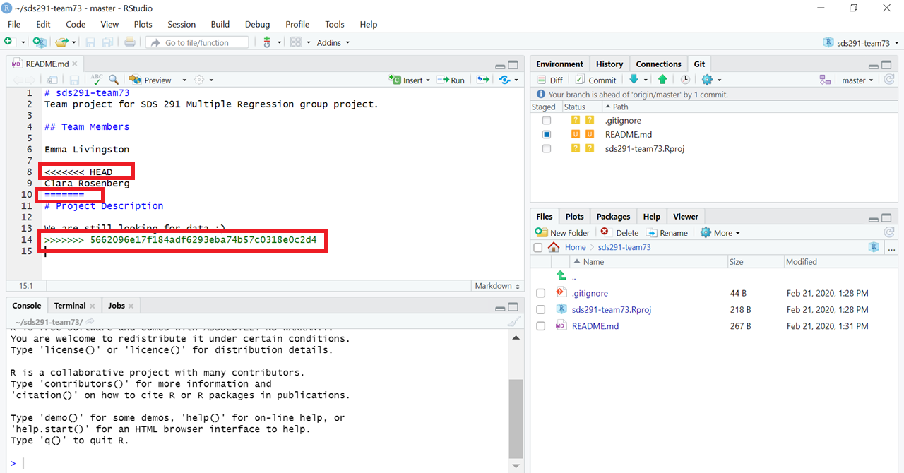

---
# How to Fix a Merge Conflict

* A "merge conflict" in your .Rmd will start with `<<<<<<<HEAD` and end with `>>>>>>>` & the commit number (which is just a bunch of letters and numbers).

 + These mark the beginning and end of where the merge conflict happened. It is important to look closely at these lines to make sure that the code still works!
 
 + In our example it is just that 2 people wrote on the same lines and then pushed, so we can simply remove the extra characters that we don't need and clean up the formatting a little bit. 
 
---
# Fix Merge Conflicts

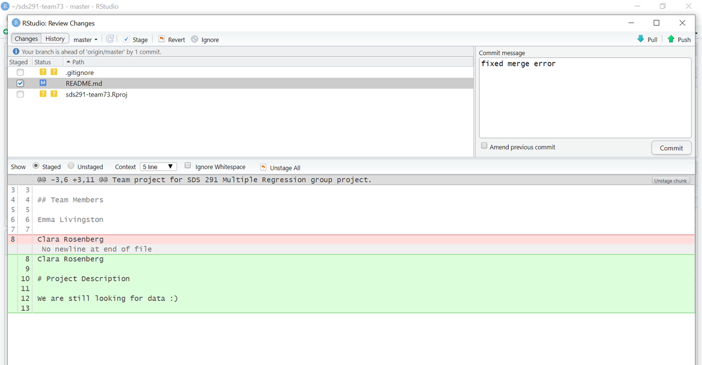

---
# Troubleshooting & Help

* [GitHub glossary](https://help.github.com/en/github/getting-started-with-github/github-glossary)

* [GitHub help](https://help.github.com/en)

---
# Git/GitHub humor

Some memes by yours truly:


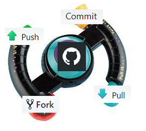
<br>


---
# More Git/GitHub humor

For when git is not cooperating:


Watch your commit messages scroll by!

[starslog.net](http://starlogs.net/#emmal73/readUCI)
